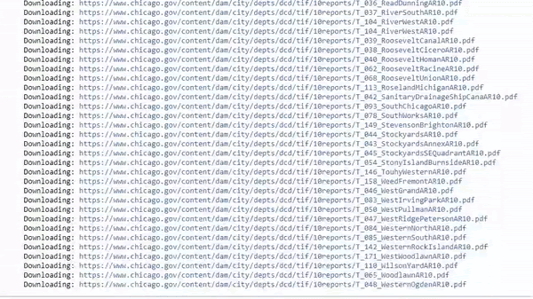
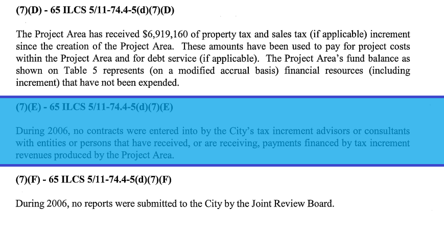
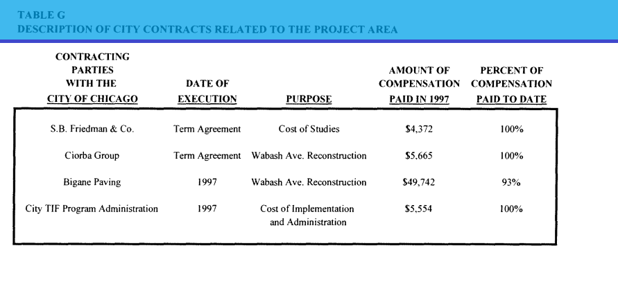
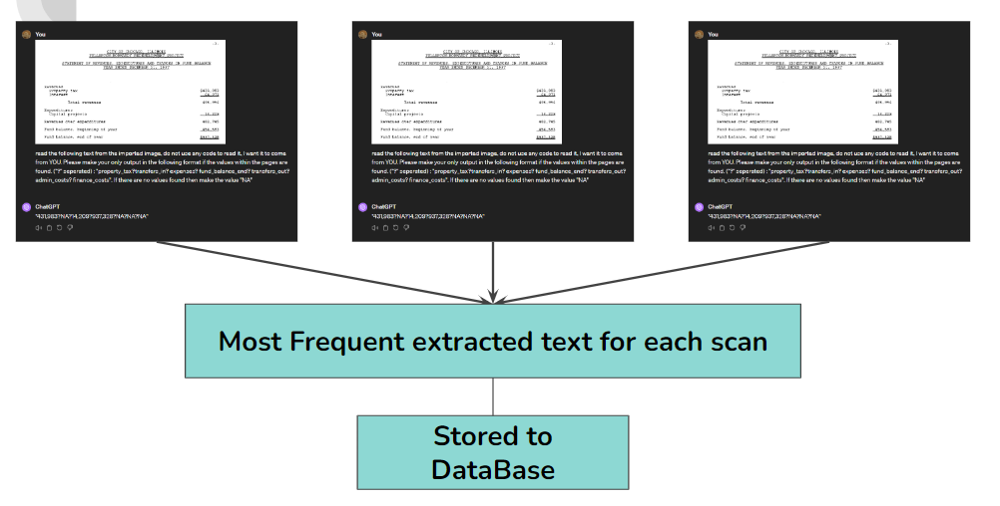
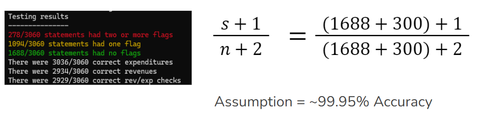

## This Repo is part of the TIFrific project for IPRO 497 at the Illinois Institute of Technology

<div>
  
</div>

# Improving Chicago’s Fiscal Transparency By Extracting Historical Financial Data Through a Machine Learning Pipeline

> Since 1986, approximately $25 billion dollars of property tax revenue collected from Chicago property owners has been diverted into Chicago's district-based Tax Increment Financing (TIF) program [[1]](https://tifreports.com/illinois-illumination). TIFs currently cover roughly 33% of the area, mi^2, in the City of Chicago [[2]](https://chicagopolicyreview.org/2023/04/13/redevelopment-for-who-how-tif-redistributes-public-funds-to-the-wealthy/). Transparency is imperative for good governance and civic involvement in decisions regarding the TIF funds considering their property taxes could be used towards potential projects which provide little community support. The lack of data has caused TIFs to face scrutiny over concerns regarding the [transparency of investment allocation](https://socialistworker.org/2017/07/27/protesting-another-tif-theft-in-chicago). Prior to 2010, TIF district data had been archived using digital scans rather than direct computer entry, reducing accessibility for analytical purposes. Although an [existing dataset](https://github.com/philipayates/chicago2022TIF) has been made by [Phillip Yates](https://github.com/philipayates). Our project outlines an algorithmic approach to extracting, organizing, and hosting Chicago TIF records dating back to 1997. We developed an automated “document to data” pipeline by leveraging Optical Character Recognition (OCR), Machine Learning (ML), and parsing algorithms technologies to perform direct data extraction from the scanned documents. We are currently hosting the existing Chicago TIF data via AWS RDS, allowing for seamlessly integrating newly extracted data, ensuring comprehensive and up-to-date records. Through this work, we hope to improve transparency, accountability, and informed civic engagement in Chicago, thereby supporting equitable urban growth.

---
## Table of Contents

- [Getting Started](#getting-started)
- [Usage](#usage)
- [Conclusion](#conclusion)
- [Future Work](#future-work)
- [TIF Resources](#tif-resources)
---

## Getting Started
#### Prerequisites
- List of technologies, libraries, or tools required to run the project are within the text file [requirements.txt](https://github.com/TIFScrapingOrg/DataScraping/blob/main/requirements.txt).


#### Installation

- Clone this repository in an arbitrary folder.

```sh
git clone https://github.com/TIFScrapingOrg/DataScraping/tree/main
```

- [How to Install Requirements.txt in Python (For Beginners)](https://www.youtube.com/watch?v=GK0usm20xes)


## Usage
This Repo contains the all of the processing programs for collecting, reading, and extracting data from old TIF reports. Execution of .py files starts fresh, unlike .ipynb (notebook) files where variables can be carried over from the last execution. If you would like to see outputs of our code without running it all, see the folder: [Notebooks](https://github.com/TIFScrapingOrg/DataScraping/tree/main/Notebooks)

### PDF Scraping
[PDF_scraping.py](https://github.com/TIFScrapingOrg/DataScraping/blob/main/PDF_scraping.py) can be used to download all Chicago annual TIF reports. All reports will be downloaded to the TIFpdfs folder in the working directory, which will be created if it does not exist. You are able to modify the varaibles "start_year" and "end_year" to download all TIF reports within the desired interval (Note the default interval is 1997 to 2022).
- The corresponding Notebook: [PDF_scraping.ipynb](https://github.com/TIFScrapingOrg/DataScraping/blob/main/Notebooks/PDF_scraping.ipynb) 


<div>
  
</div>


### Finding Contracts
[Contracts_Finder.py](https://github.com/TIFScrapingOrg/DataScraping/blob/main/Contracts_Finder.py) is used to find and save the locations of contracts within each correspending TIF year and district. Outputs a file of CSVs with the naming scheme of "Year_TIF#".
- The corresponding Notebook: [Contracts_Finder.ipynb](https://github.com/TIFScrapingOrg/DataScraping/blob/main/Notebooks/Contracts_Finder.ipynb) 


<div>
  
  
</div>


### Finding Statements
[statement_finder.py](https://github.com/TIFScrapingOrg/DataScraping/blob/main/statement_finder.py) is used to find and save the locations of statements within each correspending TIF year and district. Outputs a file of CSVs with the naming scheme of "Year_TIF#".
- The corresponding Notebook: [statement_finder.ipynb](https://github.com/TIFScrapingOrg/DataScraping/blob/main/Notebooks/statement_finder.ipynb) 

<div>
  
</div>


### GPT-4 Vision Reading
[GPT_reading.py](https://github.com/TIFScrapingOrg/DataScraping/blob/main/GPT_reading.py) is used to to read statements that contain "One" or "Many" flags. Running each statement 3 times anc taking the most frequent output after cleanup. Outputs a CSV with extracted data of pages scaned for each Year_TIF. Note the image below is a high level example of our use with the GPT vision API.
- The corresponding Notebook: [GPT_reading.ipynb](https://github.com/TIFScrapingOrg/DataScraping/blob/main/Notebooks/GPT_reading.ipynb) 

<div>
  
</div>

## Conclusion

### [Current up to date Chicago TIF records](https://github.com/TIFScrapingOrg/DataScraping/blob/main/table_parsing/full_tif_statement_data.csv)

According to the [Rule of Succession](https://en.wikipedia.org/wiki/Rule_of_succession) : "If we repeat an experiment that we know can result in a success or failure, n times independently, and get s successes, then the probability that the next experiment will succeed = $\Large\frac{s+1}{n+2}$
Therefore :

<div>
  
</div>

> Where 1688 comes from statements wher no flags were found using Tesseract and 300 comes from the 300 manually checked GPT outputs.


Our team has successfully developed a robust "document to data" pipeline that efficiently extracts historical financial data from scanned documents dating back to 1997. 

We invite developers, researchers, and civic activists to utilize this repository to explore the intricacies of TIF data in Chicago, contribute to the project’s growth, and help foster a more transparent and accountable system. Together, we can build a foundation for better urban policy and community involvement.

## Future Work


## TIF Resources
> This section was taken from the [Phil Yates README](https://github.com/philipayates/chicago2022TIF) of his TIF realted project. All Credits to this section goes to him
### What Are TIFs?
TIF stands for Tax Increment Financing. TIF Districts are designated by the municipality to capture property taxes for a fixed period of time. The captured property taxes are used to boost development in the designated TIF district. Visit the [The CivicLab](https://www.civiclab.us/) website to read more about what TIFs are and how they work. Here are two resources to start with:
- [TIF 101 Video](https://www.civiclab.us/tif-101/)
- [How Do TIFs Work?](https://www.civiclab.us/tif_illumination_project/how-do-tifs-work/)

### Where Is The Data From?
* The financial data was parsed from the City of Chicago's [TIF District Annual Report webpage](https://www.chicago.gov/city/en/depts/dcd/supp_info/tif-district-annual-reports-2004-present.html). Data from 1997-2022 inclusive was parsed from the PDFs using various Python libraries and the slight modiifcation of the existing [2010-2022 TIF database](https://github.com/philipayates/chicago2022TIF).

### What Are These Variables?

| Variable                               | Explanation                                 |
| -------------------------------------- | ------------------------------------------- |
| **TIF Lifespan**                       | The starting year through the proposed ending year. |
| **Current Data Year**                  | The year that the current data is from. |
| **Property Tax Extraction**            | The amount of property tax collected this year (within the TIF District). |
| **Cumulative Property Tax Extraction** | CUMULATIVE sum of property tax collected throughout the TIFs lifespan. |
| **Transfers In**                       | The amount transferred into this TIF District from neighboring TIF Districts this year. |
| **Cumulative Transfers In**            | CUMULATIVE sum of funds transferred into the TIF Fund from neighboring TIFs throughout the TIFs lifespan. |
| **Expenses**                           | The Total Expenditures. The amount of money spent on projects applicable to the TIF. |
| **Fund Balance End**                   | Balance of this TIF District's Fund at the end of the Current Data Year.    |
| **Transfers Out**                      | Amount of funds transferred out of the account and ported to a neighboring TIF District. |
| **Distribution**                       | Disbursement of surplus funds. This is often directed to the Treasurer for reallocation elsewhere.  |
| **Administration Costs**               | Amount taken by the City of Chicago Department of Planning for "City Staff Costs" and "City Program Management Costs". |
| **Finance Costs**                      | Amount paid to a banking institution to settle debt. This is money that was loaned to the TIF Fund previously and is now being paid back to the bank. |
| **Bank Names**                         | Bank(s) that provided the financing (Finance Costs) to the TIF Fund. |


