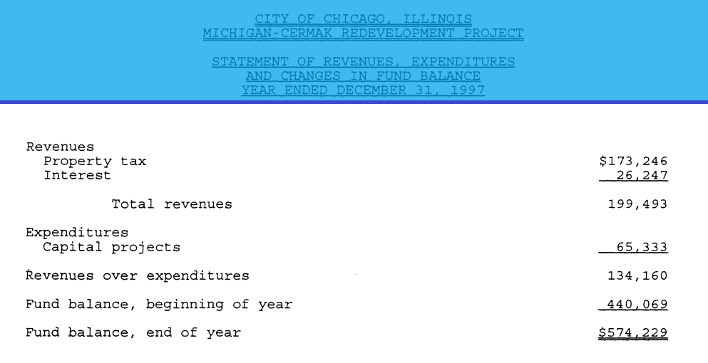

## This Repo is part of the TIFrific project for IPRO 497 at the Illinois Institute of Technology

<div>
  
</div>

# Improving Chicago’s Fiscal Transparency By Extracting Historical Financial Data Through a Machine Learning Pipeline

> Since 1986, approximately $25 billion dollars of property tax revenue collected from Chicago property owners has been diverted into Chicago's district-based Tax Increment Financing (TIF) program [[1]](https://tifreports.com/illinois-illumination). TIFs currently cover roughly 33% of the area, mi^2, in the City of Chicago [[2]](https://chicagopolicyreview.org/2023/04/13/redevelopment-for-who-how-tif-redistributes-public-funds-to-the-wealthy/). Transparency is imperative for good governance and civic involvement in decisions regarding the TIF funds considering their property taxes could be used towards potential projects which provide little community support. The lack of data has caused TIFs to face scrutiny over concerns regarding the [transparency of investment allocation](https://socialistworker.org/2017/07/27/protesting-another-tif-theft-in-chicago). Prior to 2010, TIF district data had been archived using digital scans rather than direct computer entry, reducing accessibility for analytical purposes. Although an [existing dataset](https://github.com/philipayates/chicago2022TIF) has been made by [Phillip Yates](https://github.com/philipayates). Our project outlines an algorithmic approach to extracting, organizing, and hosting Chicago TIF records dating back to 1997. We developed an automated “document to data” pipeline by leveraging Optical Character Recognition (OCR), Machine Learning (ML), and parsing algorithms technologies to perform direct data extraction from the scanned documents. We are currently hosting the existing Chicago TIF data via AWS RDS, allowing for seamlessly integrating newly extracted data, ensuring comprehensive and up-to-date records. Through this work, we hope to improve transparency, accountability, and informed civic engagement in Chicago, thereby supporting equitable urban growth.

---
## Table of Contents

- [Getting Started](#getting-started)
- [Usage](#usage)
- [Credits](#credits)
- [Conclusion](#conclusion)
- [Future Work](#future-work)
---

## Getting Started
#### Prerequisites
- List of technologies, libraries, or tools required to run the project are within the text file [requirements.txt](https://github.com/TIFScrapingOrg/DataScraping/blob/main/requirements.txt).


#### Installation

- Clone this repository in an arbitrary folder.

```sh
git clone https://github.com/TIFScrapingOrg/DataScraping/tree/main
```

- [How to Install Requirements.txt in Python (For Beginners)](https://www.youtube.com/watch?v=GK0usm20xes)


## Usage
This Repo contains the all of the processing programs for collecting, reading, and extracting data from old TIF reports. Execution of .py files starts fresh, unlike .ipynb (notebook) files where variables can be carried over from the last execution. If you would like to see outputs of our code without running it all, see the folder: [Notebooks](https://github.com/TIFScrapingOrg/DataScraping/tree/main/Notebooks)

### PDF Scraping
[PDF_scraping.py](https://github.com/TIFScrapingOrg/DataScraping/blob/main/PDF_scraping.py) can be used to download all Chicago annual TIF reports. All reports will be downloaded to the TIFpdfs folder in the working directory, which will be created if it does not exist. You are able to modify the varaibles "start_year" and "end_year" to download all TIF reports within the desired interval (Note the default interval is 1997 to 2022).
- The corresponding Notebook: [PDF_scraping.ipynb](https://github.com/TIFScrapingOrg/DataScraping/blob/main/Notebooks/PDF_scraping.ipynb) 


<div>
  
</div>


### Finding Contracts
[Contracts_Finder.py](https://github.com/TIFScrapingOrg/DataScraping/blob/main/Contracts_Finder.py) is used to find and save the locations of contracts within each correspending TIF year and district. Outputs a file of CSVs with the naming scheme of "Year_TIF#".
- The corresponding Notebook: [Contracts_Finder.ipynb](https://github.com/TIFScrapingOrg/DataScraping/blob/main/Notebooks/Contracts_Finder.ipynb) 


<div>
  
</div>


<div>
  
</div>


### Finding Statements
[statement_finder.py](https://github.com/TIFScrapingOrg/DataScraping/blob/main/statement_finder.py) is used to find and save the locations of statements within each correspending TIF year and district. Outputs a file of CSVs with the naming scheme of "Year_TIF#".
- The corresponding Notebook: [statement_finder.ipynb](https://github.com/TIFScrapingOrg/DataScraping/blob/main/Notebooks/statement_finder.ipynb) 

<div>
  
</div>


## Credits

## Conclusion

## Future Work


